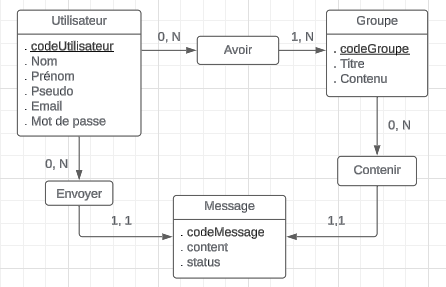
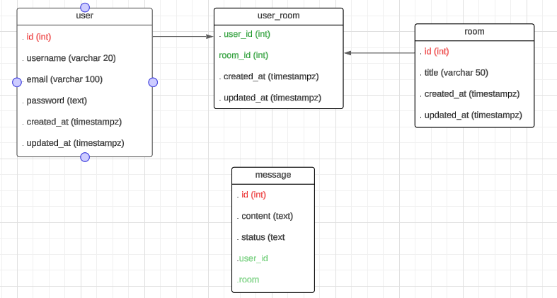

# --- Résumé du projet ---

#### [Trello du projet](https://trello.com/b/hs8i1MSs/myirc-etna)

Ce programme permet aux utilisateurs de se connecter à un serveur et d'utiliser un IRC (Internet Relay Chat), qui permet une communication de groupe et une communication individuelle via des messages privés. Il a été réalisé avec TypeScript, HTML, CSS et NodeJS en utilisant express, socket.io, bcrypt et postgreSQL pour la base de données.

Nous espérons que vous l'apprécierez !

- Les gitteurs du quartier

## --- Modèle Conceptuel des Données ---

## --- Modèle Logique des Données ---
